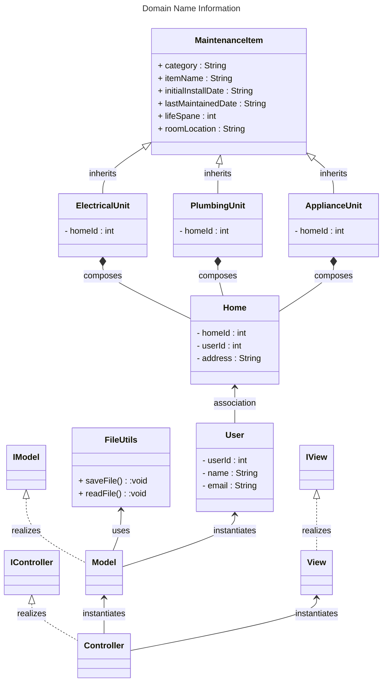

## (INITIAL DESIGN): Class Diagram

Llink to tools that can help you create a class diagram: [Class Resources: Class Design Tools](https://github.com/CS5004-khoury-lionelle/Resources?tab=readme-ov-file#uml-design-tools)

## (INITIAL DESIGN): Tests to Write - Brainstorm

## (FINAL DESIGN): Class Diagram