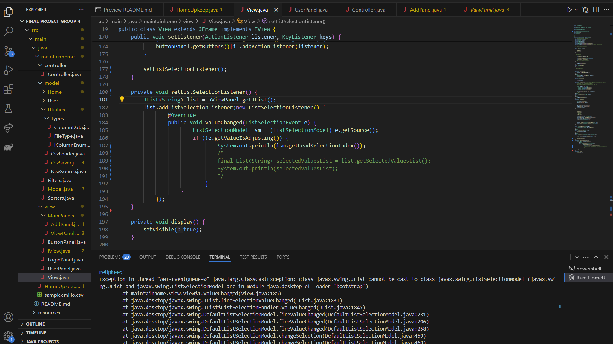
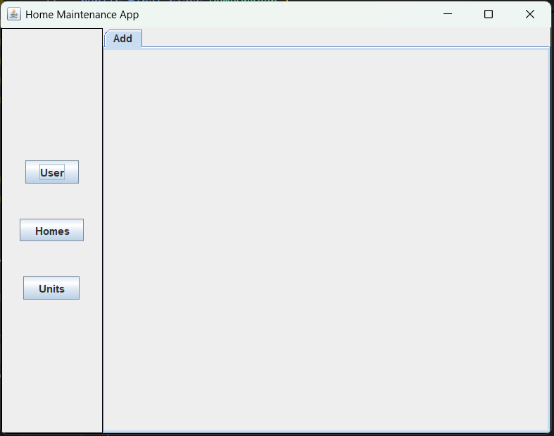
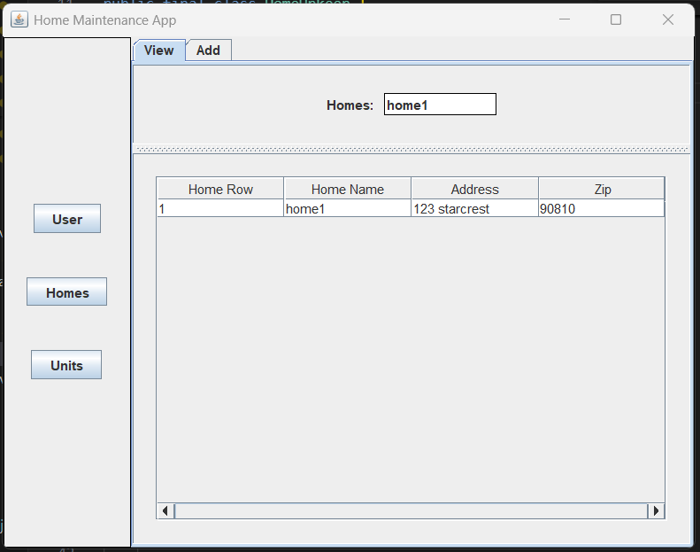
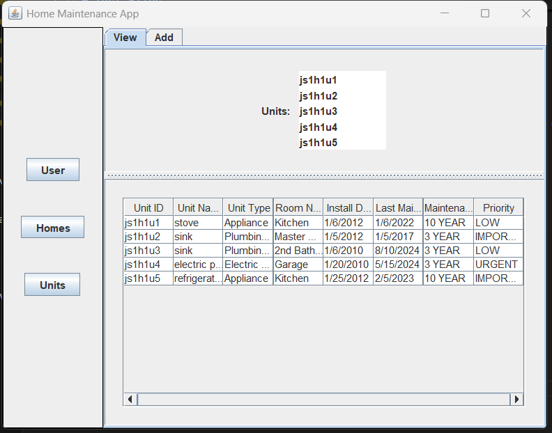
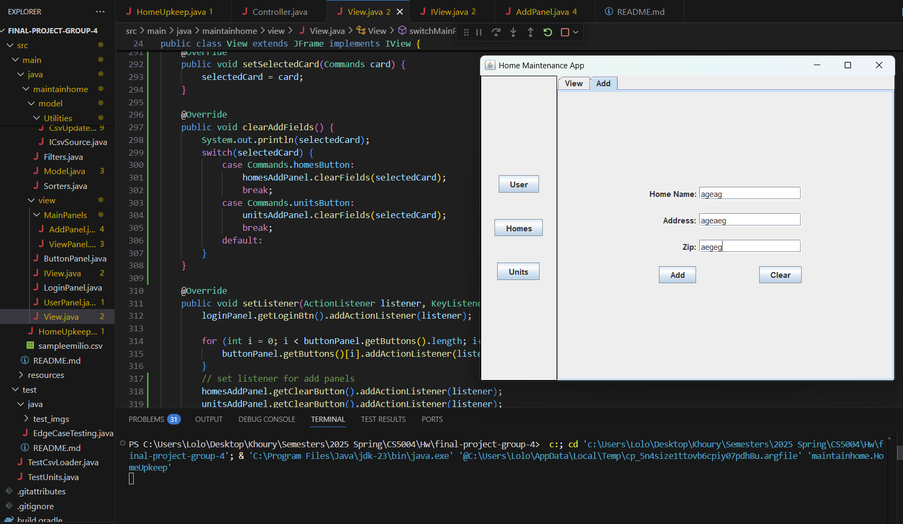
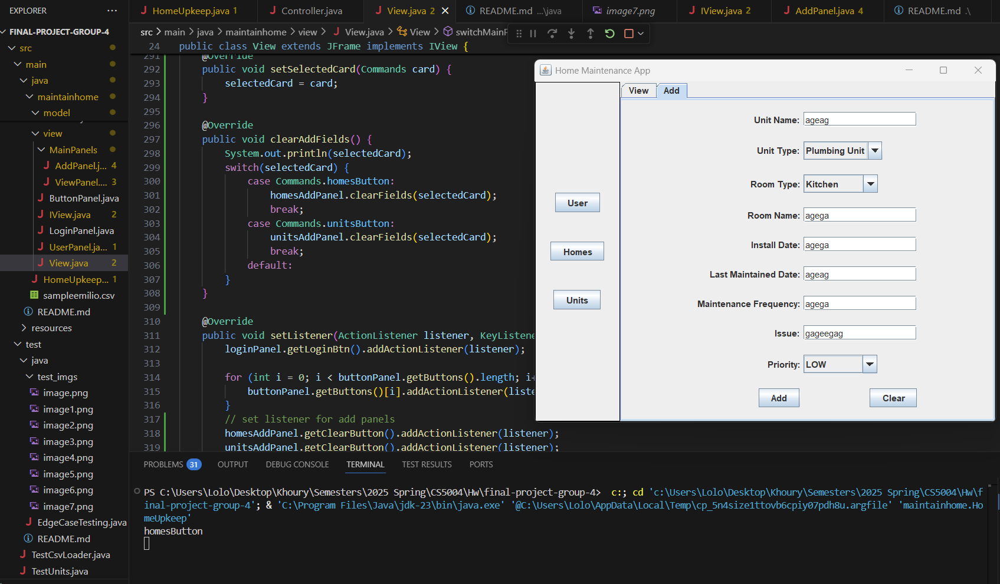
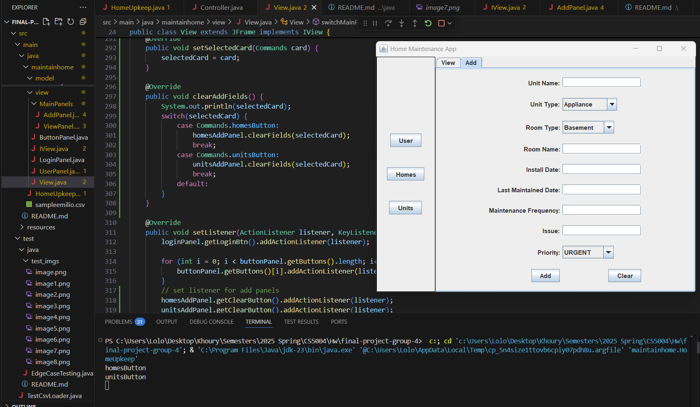
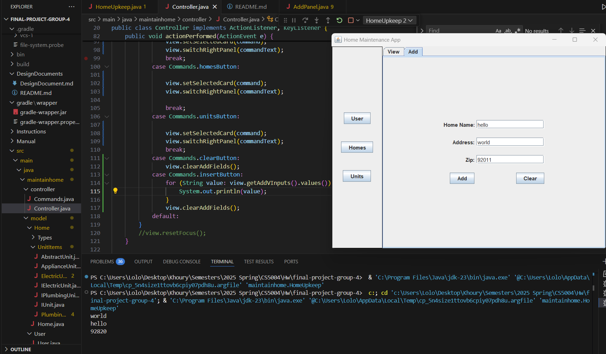
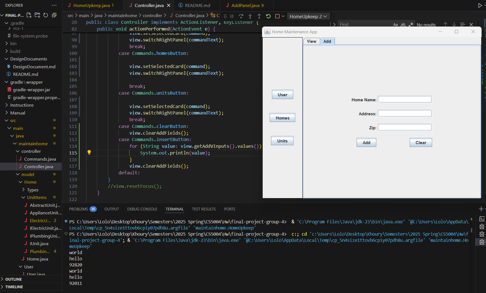

# Test Files

You should have full code coverage on your tests. 

- View error of "...adding container's parent to itself"

**Fix**: was callininvoking a scroll panel to conataint a list that was calling 

- View error with JLIst selection

- Error after adding Unit View Panel

**Fix**: was referencing the Homes View Panel on the Units Button click

### Testing Clear button in add tab  
**Homes Add Tab**

Before:   
  
After:    
  

**Units Add Tab**

Before:    

After:  

### Testing Add button in add tab  
**Homes Add Tab**

Before:   
  
After: 
